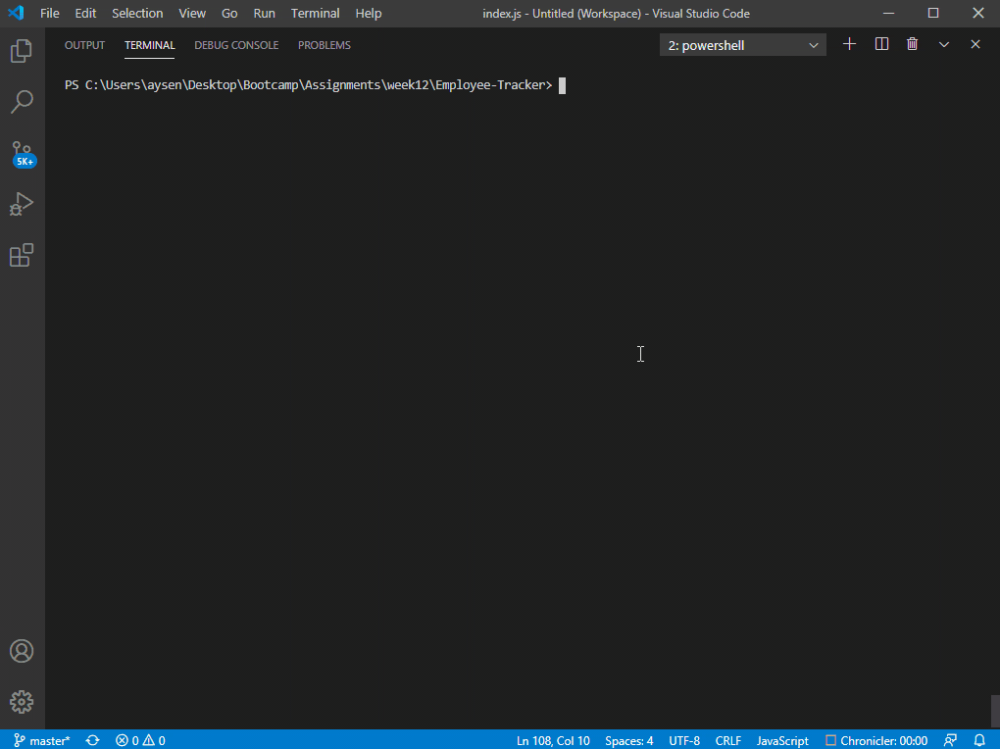

# Employee-Tracker
This repository is a solution for managing a company's employees using node, inquirer, and MySQL.

## Usage
The application will be invoked with the following command:

```sh
node index.js
```

## Steps
The user will be prompted a series of questions. These questions will let user to create departments, roles, employees, view them and update an employee's role.

Here is a recording that shows how to use the application.



### Sample SQL File

The example data shown above can be found as a sql file in this repository at the following path:
```sh
./schema.sql
```

## Questions
If you have any questions about the repo, open an issue or contact [aysendl](https://github.com/aysendl/Portfolio) directly at aysendl@gmail.com.